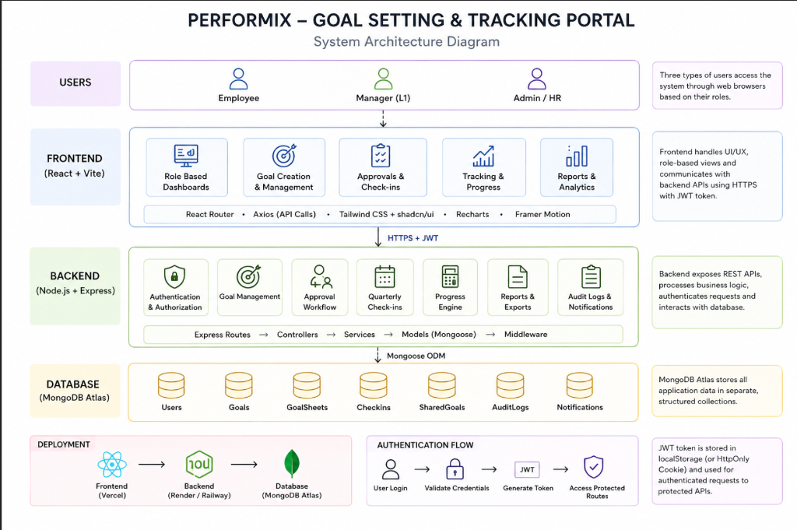

# PERFORMIX - Goal Setting & Performance Tracking Portal

Performix is a premium, enterprise-grade Goal Setting and Performance Tracking Portal built for mid-sized organizations. Designed to look and feel like a high-end corporate SaaS application, it empowers companies to align organizational objectives, track cascading KPIs, automate approvals, and generate performance analytics.

---

## 🏗️ System Architecture Diagram

Below is the complete system architecture diagram illustrating the user roles, components, tech stack, data models, and deployment configurations of the portal.



---

## 🚀 Key Features by User Persona

Performix provides customized workflows and specialized dashboards tailored to three distinct user roles:

### 1. Employee (User Portal)
* **Goal Sheet Creation**: Create and submit structured goal sheets defining SMART goals with specific thrust areas, metrics, Units of Measure (UoM), weightage targets (ensuring a total of 100%), and quarterly goals.
* **Quarterly Check-ins**: Log quarterly achievements and submit proof/comments for manager review.
* **Progress Analytics**: A dedicated analytics page featuring a Recharts-based visual dashboard with bar charts of goal progress, achievement status, and thrust-area coverage.
* **Notification Feed**: Live, real-time alerts for goal sheet status changes (approvals, revisions, unlocks).
* **Profile Management**: View personal info (role, department, manager) and edit profile details.

### 2. Manager (L1 Portal)
* **Team Overview Dashboard**: Track team-wide KPIs, view a list of direct reports, and check progress charts.
* **Goal & Check-in Review Workflows**: Review submitted goal sheets or quarterly check-ins. Approve, reject, or return them with comments for revisions.
* **Shared Goal Manager**: Assign and distribute shared departmental goals to multiple team members simultaneously.
* **Reporting Module**: Run detailed team progress reviews and export data to downloadable reports.

### 3. Administrator / HR Portal
* **User Management (Full CRUD)**: Create, edit, update roles/departments, and delete users via an administrative modal dashboard.
* **Override & Lock Controls**: Manually unlock approved goal sheets or check-ins to allow employees to make mid-year corrections.
* **Security & Audit Logs**: A dedicated audit viewer showing system-wide database logs (logins, goal creations, manager reviews, and CRUD events) to ensure complete data integrity.
* **Company Analytics**: Access high-level analytics and export system logs.

---

## 🔑 Demo & Evaluation Credentials

To facilitate immediate testing and evaluation of the different workflows, the application comes seeded with the following predefined accounts:

| Role | Email Address | Password |
| :--- | :--- | :--- |
| **System Admin** | `admin@gmail.com` | `admin` |
| **Manager (L1)** | `manager@gmail.com` | `manager` |
| **Employee (Demo User)** | `demouser@gmail.com` | `user` |

---

## 🛠️ Technology Stack

Performix is engineered with a modern, highly responsive, and robust tech stack:

* **Frontend**:
  * **React (Vite)**: Component-driven single-page architecture.
  * **Tailwind CSS**: Sleek styling with custom utility styling and a fully responsive grid system.
  * **CSS Themes**: Premium light and dark mode styling with custom colors and glassmorphism accents.
  * **Recharts**: Responsive data visualization charts for progress.
  * **Framer Motion**: Micro-animations for page transitions, sidebar shifts, and modal triggers.
  * **Sonner**: High-polish toast notifications for real-time feedback.
  * **Axios**: Interceptors for automatic bearer token attachments.

* **Backend**:
  * **Node.js & Express**: High-performance RESTful API.
  * **JWT Authentication**: Secure user session tracking via JSON Web Tokens.
  * **Mongoose ODM**: Structured object schemas matching MongoDB collections.
  * **Bcrypt.js**: Salting and secure hashing of passwords.

* **Database**:
  * **MongoDB Atlas**: Fully-managed cloud document database.

* **Deployment**:
  * **Frontend**: Optimized static hosting (Vercel).
  * **Backend**: Containerized backend services (Render / Railway).
  * **Database**: Cloud cluster hosting (MongoDB Atlas).

---

## 📂 Project Structure

```
AtomQuest/
├── architecture_diagram.png      # System Architecture Diagram
├── backend/                      # Node.js + Express API Backend
│   ├── package.json
│   ├── seed.js                   # Root Database Seeding Script
│   ├── server.js                 # Server Entrypoint
│   └── src/
│       ├── config/               # Database and Env Config
│       ├── controllers/          # Business logic handlers
│       ├── middleware/           # Auth and Logging filters
│       ├── models/               # MongoDB Mongoose Schemas (User, Goal, AuditLog, etc.)
│       └── routes/               # API endpoints
└── frontend/                     # React + Vite Frontend
    ├── package.json
    ├── tailwind.config.js
    └── src/
        ├── App.jsx               # App Routes and Routing Setup
        ├── main.jsx              # App Mount point
        ├── index.css             # Main styling system, variables, and dark mode tokens
        ├── context/              # Context Providers (AuthContext, ThemeContext)
        ├── services/             # Axios API base configuration
        ├── pages/                # High-level views (LandingPage, Login, Dashboard, Register)
        └── components/           # UI Elements
            ├── common/           # Shared views (ProfilePage, Skeleton loaders)
            ├── dashboards/       # Role-specific Dashboards (Admin, Manager, Employee)
            └── goals/            # Goal sheets, quarterly inputs, and review workflows
```

---

## 📡 API Endpoint Directory

### Authentication
* `POST /api/auth/register` - Create a new user account.
* `POST /api/auth/login` - Authenticate credentials and retrieve JWT.
* `GET /api/auth/me` - Get the current logged-in user profile context.

### Goal Management
* `GET /api/goals` - Fetch goal sheets for the current employee/manager.
* `POST /api/goals` - Create/submit a new goal sheet.
* `PUT /api/goals/:id` - Update goal sheet contents.
* `PATCH /api/goals/sheet/:id/status` - Change goal sheet status (Approve / Reject / Request Revision).
* `POST /api/goals/unlock/:id` - Admin override to unlock a locked goal sheet.

### Quarterly Check-Ins
* `GET /api/checkins` - Retrieve history of check-ins.
* `POST /api/checkins` - Submit a quarterly achievement check-in.
* `POST /api/checkins/:id/review` - Approve or reject a quarterly check-in update (Manager).

### Shared Goals
* `POST /api/shared-goals` - Distribute shared goals to team members (Manager).
* `GET /api/shared-goals` - Retrieve shared goals for the current manager's department.

### Admin Tools
* `GET /api/admin/users` - Retrieve all registered users.
* `POST /api/admin/users` - Create a new user account.
* `PUT /api/admin/users/:id` - Edit user credentials or roles.
* `DELETE /api/admin/users/:id` - Remove a user.
* `GET /api/admin/logs` - Fetch all system audit logs.

### Notifications
* `GET /api/notifications` - Retrieve alerts for the logged-in user.
* `PATCH /api/notifications/:id/read` - Mark a notification as read.

---

## ⚙️ Setup & Installation Instructions

Follow these steps to configure and run Performix locally:

### Prerequisites
* **Node.js** (v16.x or higher)
* **MongoDB** (Local instance or MongoDB Atlas Connection URI)

---

### Step 1: Configure the Backend

1. Navigate to the backend directory:
   ```bash
   cd backend
   ```
2. Install dependencies:
   ```bash
   npm install
   ```
3. Create a `.env` file in the `backend/` folder based on `.env.example`:
   ```env
   PORT=5000
   MONGO_URI=mongodb+srv://<username>:<password>@cluster.mongodb.net/performix
   JWT_SECRET=your_super_jwt_secret_key
   CLIENT_URL=http://localhost:5173
   ```

---

### Step 2: Seed the Database

Seed the initial users (Admin, Manager, Employee) and setup data:
```bash
npm run seed
```
*Note: This script wipes any existing users and inserts the standard evaluation accounts.*

---

### Step 3: Run the Backend Server

Start the backend in development mode (runs on port `5000`):
```bash
npm run dev
```

---

### Step 4: Configure & Run the Frontend

1. Open a new terminal and navigate to the frontend directory:
   ```bash
   cd frontend
   ```
2. Install dependencies:
   ```bash
   npm install
   ```
3. Start the frontend development server:
   ```bash
   npm run dev
   ```
4. Access the application in your browser at: [http://localhost:5173](http://localhost:5173)
